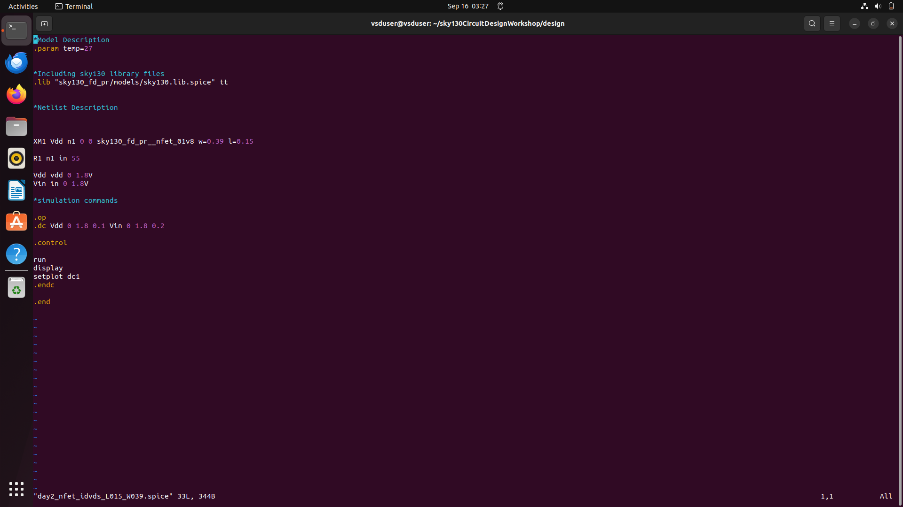
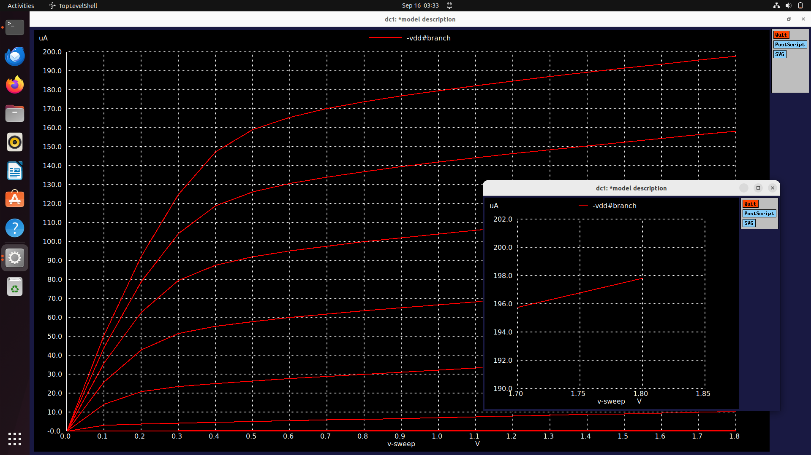
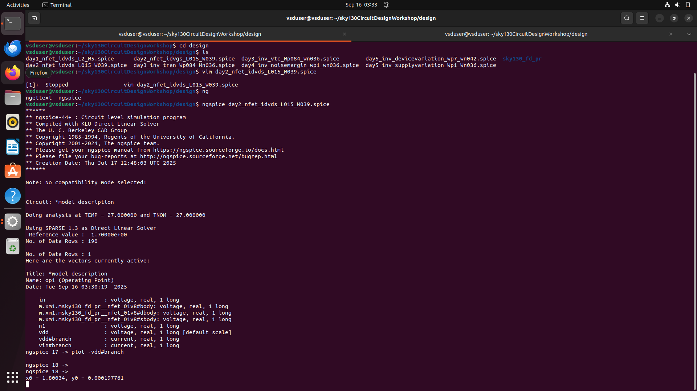
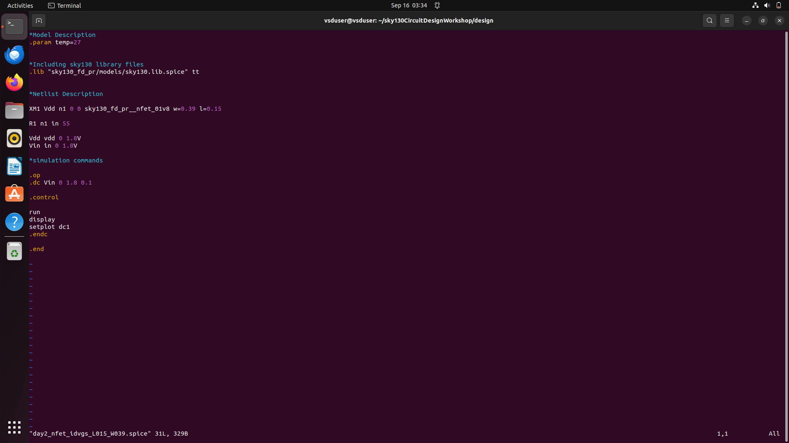
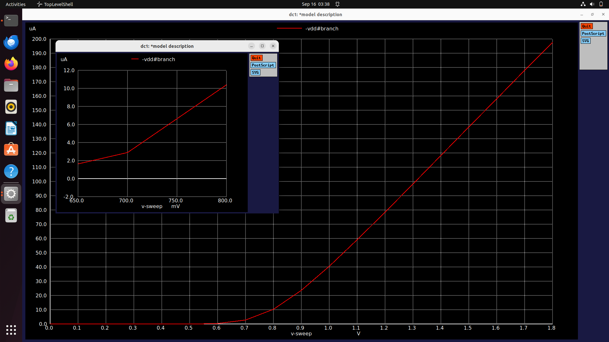
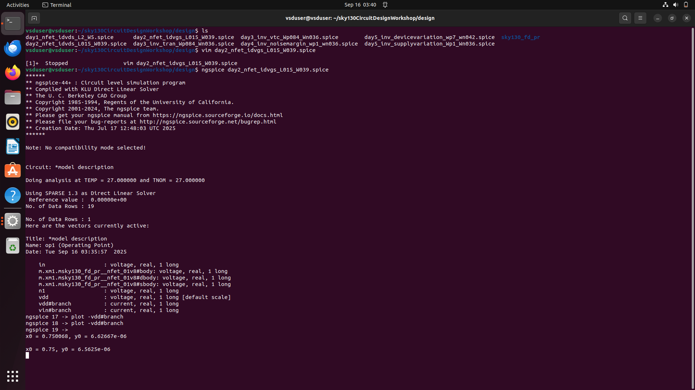

# Day 2 : Understanding the basics of CMOS inverter and VTC curve
## Today's goals : 
## 1. To study the simulation for low nodes and velocity saturation 
## 2. Study CMOS voltage transfer characteristics 

### Step 1 : Sweep the Vin and  Vdd ( Output characteristics ) 

Here we can see that we sweep Vdd 0 -> 1.8 V by steps of 0.1 V for a fix value of Vin .   Then the Vdd is again sweeped for another Vin .

This Vin change is defined as it changes from 0 -> 1.8 V by step of 0.2 V . 

### Step 2 : Plot the **Graph** 

run **plot -vdd#branch** to plot the graph .   
This is the output characteristics Graph . 

Now we will locate the point where the curve is at VDD = 1.8 , but whats its value of Id . <br.
Clicking on the curve intersecting the 1.8 V gridline prints the coordinates in the NGSPICE terminal . 

### Step 3 : Note the readings of the graph 

Here  we observed that the x0 = 1.80034 have y0 = 0.0001976

### Step 4 : Sweep only Vin keeping Vdd fixed .

In this VIM editor , we observe that the sweep function of Vdd is missing as its taken as fixed value and the Vin is gonna sweep from 0 -> 1.8 V by step of 0.1 V .  

### Step 5 :  Plot the input characteristics graph 

Run **plot -vdd#branch** in the NGSPICE teerminal .   
The graph seen now can be refered as the input characteristic where the Vdd is fixed and Vin changes .

### Step 6 : Note the readings 

Clicking the curve at 0.75 V and it prints the coordinates in the SPICE terminal .

    Things to remember :  Below threshold voltage (Vth), ID ≈ 0.
                          Above Vth, ID rises quadratically (in saturation).
                          Shows strong dependence on VGS.

